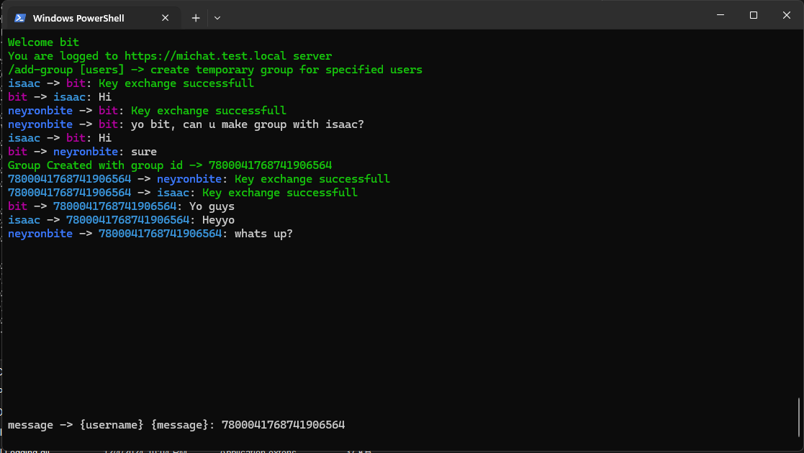
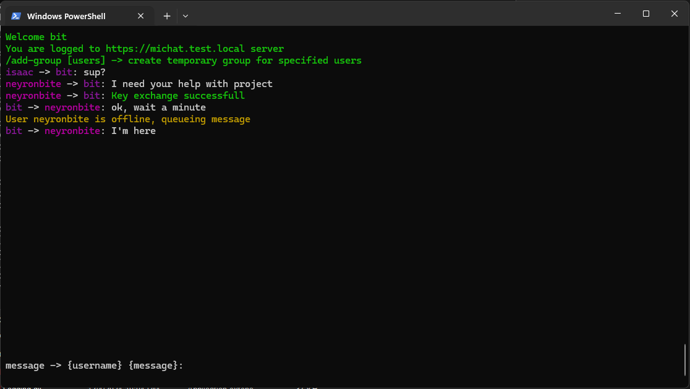

# Mi(j)Chat - End-to-End Encrypted CLI Chat
### version 1.1

Mi(j)Chat is a simple command-line interface (CLI) chat application that provides end-to-end encryption. The server never knows what users are sending to each other, ensuring full privacy and anonymity. All communications are fully encrypted, and the server does not store any messages or personal data.





## What's New

- **Group Chat**: Create temporary end-to-end encrypted group chats with multiple users.
- **Improved UI/UX**: Updated command-line interface for a more intuitive experience.


## Features

- **End-to-End Encryption**: All messages are encrypted using AES, with keys exchanged securely using RSA.
- **Simple Usage**: A clean and minimal CLI interface for chatting.
- **Full Security**: All messages are encrypted, ensuring that no one can read your messages except the intended recipient.
- **Anonymity**: No user personal data are stored on the server (email, phone number ...).
- **Server Does Not Save Messages**: Messages are queued on the server only if the recipient is offline and are deleted once successfully delivered.

## How It Works

When a user registers with the server, the client generates an RSA key pair. The public key is sent to the server, while the private key is securely stored locally in a password-encrypted file. This ensures that only the user has access to their messages.

When chatting with another user, a new AES key is exchanged securely using RSA encryption. Messages are not saved on the server and are only delivered when the recipient is online. If a user goes offline, messages will be queued and sent when they are available again.

## Installation

### For Linux:

1. Download the latest release from the provided link.
	[CliChatClientRelease-v1.1-Linux.zip](https://github.com/Neyronbite/CliChatClient/releases/download/v1.1-linux/CliChatClientRelease.1.1.Linux.zip)
2. Navigate to the folder where the file was downloaded.
3. Add executable permissions to the `CliChatClient` file:
   ```bash
   sudo chmod +x CliChatClient
   ```
4. Execute it

### For Windows:
1. Download the latest release from the provided link.
	[CliChatClientRelease-v1.1-wind.zip](https://github.com/Neyronbite/CliChatClient/releases/download/v1.1-wind/CliChatClientRelease.1.1.Wind.zip)
2. Execute the CliChatClient.exe file from cmd.

## Usage

To run the application, you need to specify certain arguments.

### Arguments:
- `-l --login`: Login request
- `-r --register`: Register request
- `-u --username <username>`: Your username
- `-s --server <server>`: The server to connect to (e.g., `my-server.com:5000`)
- `-i --ignore-ssl`: Ignore SSL validation (use only if needed)
- `--unicode`: Uses unicode encoding

### Example:

To register a new user:	
```bash
./CliChatClient.exe -r -u test_user -s my-server.com:5000
```

This will connect to `my-server.com` on port 5000, ask for your password, and send a registration request with your generated public key.

To login as an existing user:
```bash
./CliChatClient.exe -l -u test_user -s my-server.com:5000
```
This will send a login request with your username and password.

## Inside the chat program:

Once you're logged in, you can send messages to other users. To send a message, type the recipient's username followed by the message. For example:

```bash
test_user hi
```
This will initiate a key exchange with `test_user` and send the message "hi".

### Navigation Keys:
- **Backspace**: Delete the last character.
- **Tab**: Remembers your input text (useful for auto-completing usernames).
- **Esc**: Resets remembered text.
- **Up/Down Arrow**: Scroll through your message history.
- **Page Up/Down**: Scroll up and down in the chat window.

### Chat Commands:
- `/add-group [user1] [user2] [...]`: Creates a temporary group chat with specified users. Entire conversation is end-to-end encrypted.


## Authorization

Mi(j)Chat uses JWT (JSON Web Tokens) for authentication. Once logged in or registered, the server will provide a JWT to authenticate subsequent requests.

---

## Security Considerations And Limitations

- **RSA Key Pair**: The client generates an RSA key pair (public and private keys). The private key is securely stored in a password-encrypted file.
- **AES Encryption**: When communicating with other users, AES encryption is used for message encryption. The AES keys are exchanged securely using RSA.
- **Queueing**: After starting chat with someone, if the recipient goes offline, messages will be queued until they return.
- **No Message Storage**: The server does store only messages, that need to be queued. Messages are deleted after delivery, ensuring that no data is retained on the server. The application does not store any chat history too; all messages are ephemeral.
